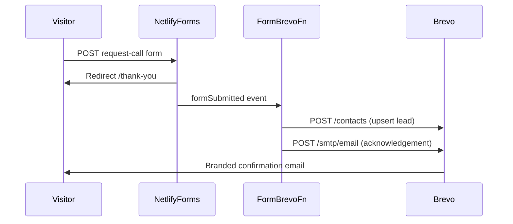

# Netlify Forms → Brevo integration

Netlify still **detects and stores** every `request-call` and `request-service` submission. After a submission is verified, the `formSubmitted` handler in `site/netlify/functions/form-brevo.mts` runs automatically and:

1. **Creates or updates** a Brevo contact with the lead details.
2. **Sends a branded acknowledgement email** to the customer (logo + KOM USA green palette).

No change is required to the HTML forms — they keep `data-netlify="true"` and POST to `/thank-you`.

## Prerequisites

1. **Brevo account** with an API key (`SMTP & API` → API keys).
2. **Verified sender** in Brevo for `contact@kom-usa.com` (or set `BREVO_SENDER_EMAIL`).
3. **Netlify Forms enabled** for the site (Project configuration → Forms).

## One-time Brevo setup

From `site/` with `BREVO_API_KEY` in `.env`:

```sh
node scripts/brevo-setup.mjs
```

This creates custom contact attributes (`CITY`, `SERVICE`, `NOTE`, `LAST_FORM`, etc.) and prints available list IDs.

Create a **Website leads** list in Brevo if you want new contacts added to a list, then note the list ID.

## Netlify environment variables

Set in **Site settings → Environment variables** (production at minimum):

| Variable | Required | Purpose |
| --- | --- | --- |
| `BREVO_API_KEY` | Yes | Brevo v3 API key |
| `BREVO_LIST_ID` | No | Contact list for new leads |
| `BREVO_SENDER_EMAIL` | No | Defaults to `contact@kom-usa.com` |
| `BREVO_SENDER_NAME` | No | Defaults to `KOM USA` |

See `site/.env.example` for the full list.

## Email branding

Acknowledgement emails use:

- Header band: `#2f6b3b` (kom-field green)
- Accents: `#78a866` (kom-sage)
- Body text: `#33383e` (kom-charcoal)
- Logo: `https://kom-usa.com/logo-email.png` (white wordmark PNG in `site/public/`)

Regenerate the PNG from the white SVG if the logo changes:

```sh
node -e "import('sharp').then(s=>s.default('src/assets/logos/kom-usa-logo-white.svg').resize(400).png().toFile('public/logo-email.png'))"
```

## Local verification

```sh
cd site
npm install
node --experimental-strip-types netlify/functions/_shared/parse-submission.test.mts
npx astro check
```

End-to-end Brevo delivery only runs on **Netlify** after a verified form submission (not during `astro dev`).

## Flow


